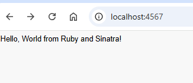
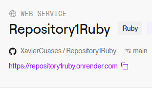
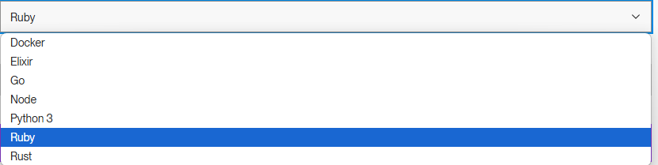
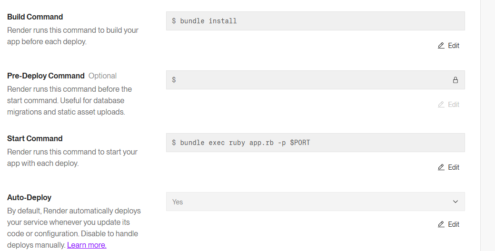

# Hello world whit in Ruby
## Results
<p align="center">
   
</p>

In this "Hello World" program written in Ruby with Sinatra, a basic web server is started that listens for HTTP requests on port 4567. When a user navigates to http://localhost:4567, the server responds by sending a simple "Hello, World" message. Sinatra is a lightweight web framework for Ruby that makes it easy to create web applications. The application is run using Puma, which is the default web server for Sinatra.

## :open_book: How to use
* Clone the repository

    ```
    git clone https://github.com/XavierCuases/Repository1Ruby.git
    ```
> [!NOTE]
This project is a basic Ruby web application built using the Sinatra framework. The core file, app.rb, starts a server that listens on port 4567, serving a "Hello World" message when accessed through a web browser at http://localhost:4567. Essential files such as Gemfile manage project dependencies, while an optional Dockerfile facilitates containerization, making the application portable across different environments.
By leveraging Ruby, Sinatra, and Docker, this project offers a practical introduction to web development, dependency management, and containerized deployments.

## :rocket: How to run in docker
### Pre-requisites
* Docker - DockerDesktop installed
* DockerHub account

### link image docker hub 

### Download image

[ImagenNodeRuby](https://hub.docker.com/r/xaviercuases/ejercicio1ruby "click for visit")

The link will be for the image to be able to download it
```
docker pull xaviercuases/ejercicio1ruby
```
> [!IMPORTANT]
> By default, this Ruby application runs on port 4567 when using Sinatra and Puma for local development. If you need to change the port, the Sinatra application allows you to specify a different one when running the application.
### Run image
```
docker run --name <NEWCONTAINERNAME> -d -p 4567:4567 <IMAGENAME>
```
> [!TIP]
> The name of the downloaded image must match the one used in the previous command. You can verify the image name using the docker images command. Additionally, check that there is no other container with the same name as the one you're using.

[View results](#results)

## :light_rail: PAAS Deploy with docker (render)
For its deployment in a PAAS we will rely on Render and its easy implementation thanks to its container management. 



This project is deployed on Render, which supports multiple programming languages, including Ruby. Render makes it easy to deploy your applications using Docker.

This project uses Ruby with the Sinatra framework to run a web application on Render. Simply select "Docker" during deployment, connect your repository, and follow Render’s setup instructions.



> [!IMPORTANT]
> Next, This project is configured to deploy on Render with the following settings:

Render deployment configuration:

Build Command: bundle install to install all Ruby dependencies.
Start Command: bundle exec ruby app.rb -p $PORT to start the Sinatra application and bind it to the port assigned by Render.




## Link service PASS

[Hello World](https://repository1ruby.onrender.com "click for visit")
